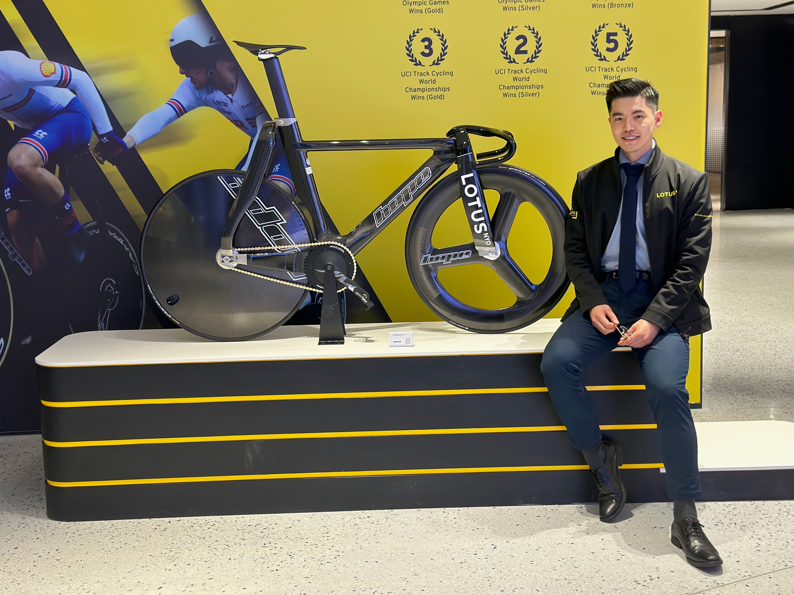
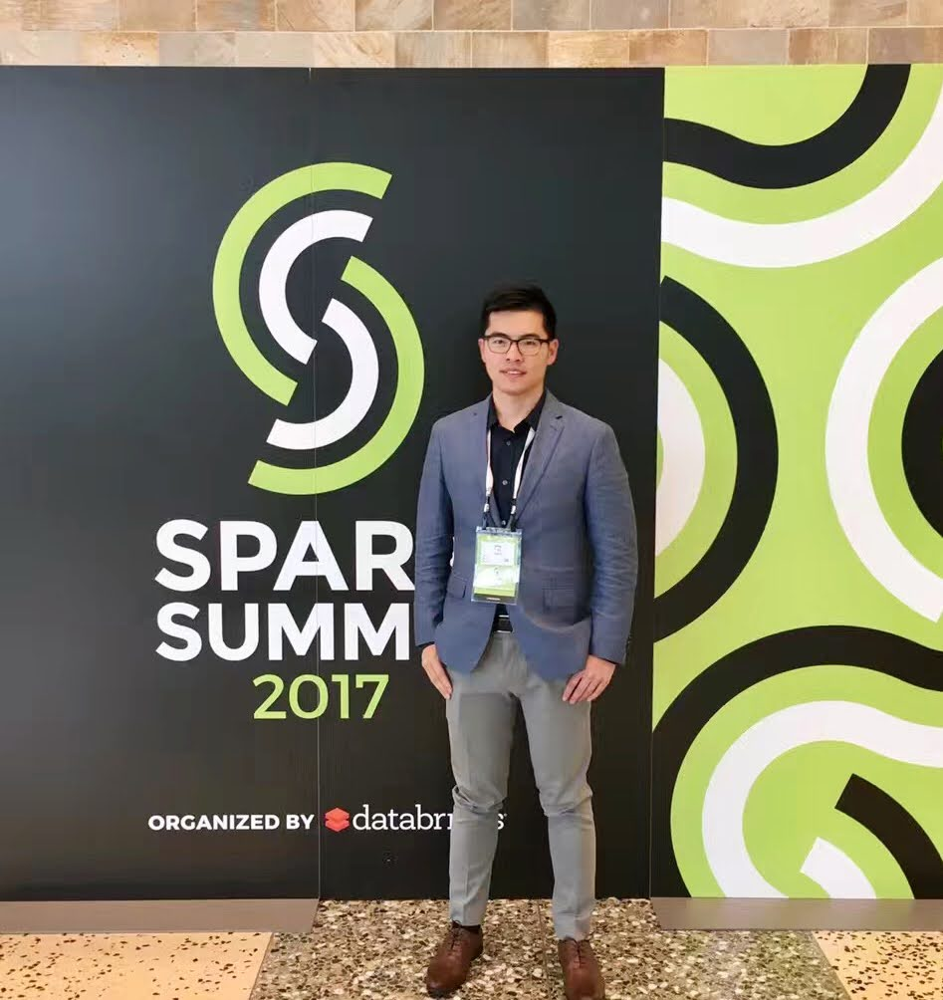
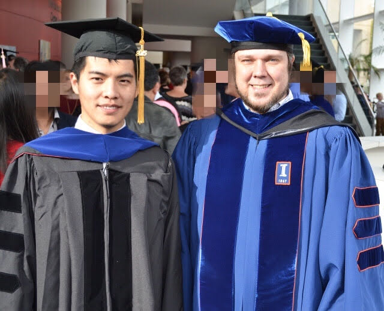
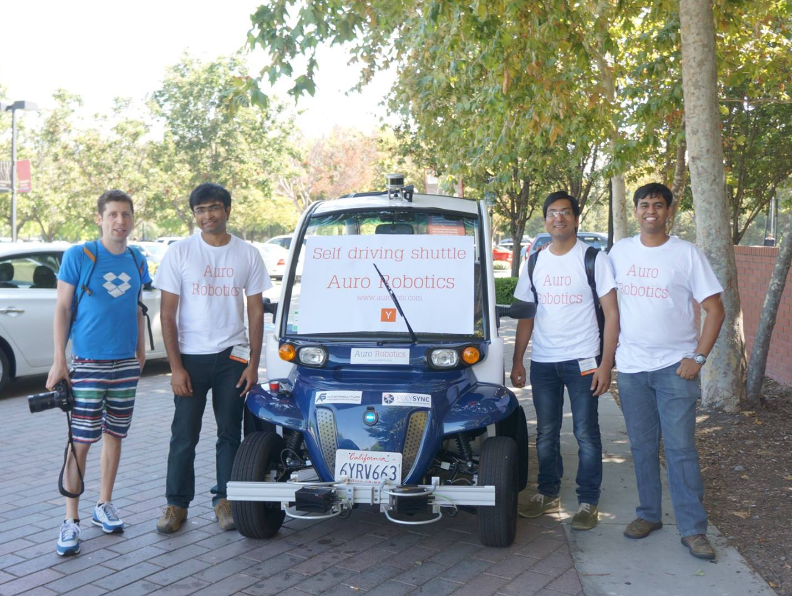

# Portfolio

* * *

I have been with [Lotus Cars](https://www.lotuscars.com/de-DE) as a Senior Algorithm Engineer since 2022. At Lotus, I manage the SaaS platform on AWS, which processes collected test data to enhance ADAS functionalities.

My role closely aligns with that of a cloud architect. My responsibilities encompass cloud infrastructure, SaaS application development and DevOps, data privacy and lifecycle management and compliance, as well as project planning.

The photo below was taken at the Lotus store in Shanghai, featuring me and the 'Lotus x Hope' bicycle, which will be used by the British Cycling team in the 2024 Paris Olympics.

My first job in Germany began in 2019 at [Aptiv](http://www.aptiv.com), where I served as a Senior Algorithm Engineer. I contributed to ADAS function development for BMW and PSA projects, leading the software development for radar processing and perception on [Motional](http://www.motional.com)'s Level 4 autonomous driving [robotaxi based on IONIQ 5](https://motional.com/news/motional-and-lyft-deliver-first-rides-motionals-new-all-electric-ioniq-5-autonomous-vehicle).

Prior to my move to Germany, I worked for [Groupon](http://www.groupon.com) as a back-end software engineer for 3.5 years, based in Seattle, USA, and Dublin, Ireland.

In Seattle, I was part of the marketing team. At an online e-commerce marketplace like Groupon, the Customer Relationship Management (CRM) platform is a crucial tool for driving sales growth. During this time, I gained valuable experience in developing web services using modern, agile software engineering practices. I also developed a strong sense of ownership and honed my skills in collaborating with team members, cross-functional teams, and product managers to deliver impactful features. My team was responsible for several scalable, highly available systems that handled millions of requests per day. My hands-on engineering experience included: 1) back-end REST service development with Java and 2) data engineering within the Hadoop ecosystem (HDFS, YARN, Hive, Spark) using Scala.

This one was shot when I was attending the Spark Summit 2017 with the team.

In Dublin, I transitioned to the goods team to support the EMEA merchandise platform. Although this application did not require "realtime" performance and handled lower traffic compared to my previous projects, I faced new challenges in developing front-end features with a JavaScript framework and back-end features with Rails, providing me with valuable "full-stack" experience.

## Education

From 2010 to 2015, I studied at the [University of South Carolina](https://sc.edu/) and obtained my Ph.D. degree in Computer Science. I accomplished [research projects](#research-experience) on robotics, multi-robot systems, localization, motion planning, and computational geometry by working with my Ph.D. advisor, [Dr. Jason M O'Kane](https://cse.sc.edu/~jokane/).

Below is a picture of me with Dr. O'Kane. Many of those who work on the robotics are familiar with Dr. O'Kane because of his books, ["A Gentle Introduction to ROS"](https://www.goodreads.com/book/show/26017473-a-gentle-introduction-to-ros).

My research proposed novel algorithms for multi-agent systems. Robots can form various repeated lattice patterns, including squares, hexagons, octagon-squares, etc. by autonomously organizing themselves in a distributed or decentralized manner. (There are some similarities between the communication model of multi-agent systems and [V2V communication](https://www.nhtsa.gov/technology-innovation/vehicle-vehicle-communication)) 

Y. Song and J. M. O'Kane, "Decentralized formation of arbitrary multi-robot lattices," ICRA, Hong Kong, 2014.[URL](http://ieeexplore.ieee.org/stamp/stamp.jsp?tp=&arnumber=6906994&isnumber=6906581)

<iframe width="450" height="450" src="https://player.vimeo.com/video/120422876" frameborder="0" allowFullScreen mozallowfullscreen webkitAllowFullScreen></iframe>

Y. Song and J. M. O'Kane, "Forming repeating patterns of mobile robots: A provably correct decentralized algorithm," IROS, Daejeon, 2016. [URL](https://ieeexplore.ieee.org/abstract/document/7759844)

<iframe width="450" height="400" src="https://player.vimeo.com/video/130678443" frameborder="0" allowFullScreen mozallowfullscreen webkitAllowFullScreen></iframe>

## YCombinator Startup Experience

The most exciting engineering project of my career was in 2015, when I worked with seven engineers at [Auro.ai](http://auro.ai/), a [Y Combinator](https://www.ycombinator.com/)-backed startup, to build a self-driving shuttle. That summer, I shared unforgettable experiences with the team and three founders, working tirelessly on an electric golf cart in a Sunnyvale, California garage. Our hard work paid off when we successfully achieved autonomous driving!

The photo below shows three engineers, including me on the far left, and the three co-founders (in white T-shirts) after testing the autonomous shuttle on the Santa Clara University campus ([Youtube video](https://youtu.be/5wIv-CZRwSU)).

The picture of me below was taken in front of the Computer History Museum, Mountain View, California. We demonstrated our self-driving shuttle in the YC Demo Day Summer 2015. The [Auro](http://auro.ai) was highlighted in the news on the [Tech Crunch](https://techcrunch.com/2015/08/18/hardware-demo-day/) and [Venture Beat](https://venturebeat.com/2015/08/19/11-startups-you-should-know-from-y-combinators-summer-2015-demo-day/), etc.

I also took a photograph for Sam Altman and the co-founders of Auro: Srinivas Reddy, Nalin Gupta, and Jit Ray Chowdhury.

