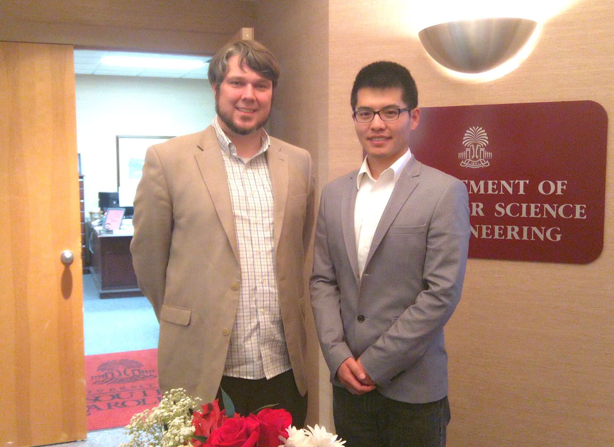
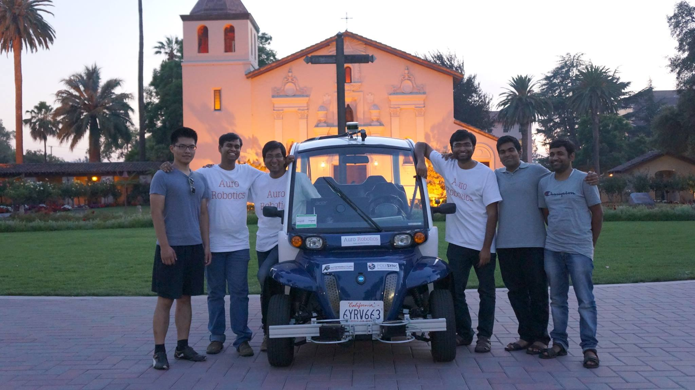
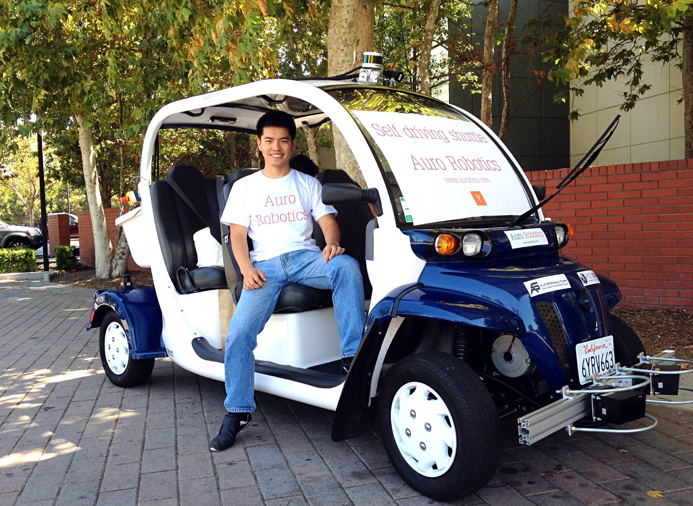

# Portfolio

* * *

## Education

From 2010 to 2015, I studied at the [University of South Carolina](https://sc.edu/) and obtained my Ph.D. degree in Computer Science. I accomplished [research projects](#research-experience) on robotics, multi-robot systems, localization, motion planning, and computational geometry by working with my Ph.D. advisor, [Dr. Jason M O'Kane](https://cse.sc.edu/~jokane/).

Below is a picture of me with Dr. O'Kane. Many of those who work on the robotics projects are familiar with Dr. O'Kane because one of his books, ["A Gentle Introduction to ROS"](https://www.goodreads.com/book/show/26017473-a-gentle-introduction-to-ros), is popular among the ROS users. I quickly mastered how to use ROS for my research projects by reading this book and strongly recommend this book to the ROS beginners :D.

## YCombinator Startup Experience

The coolest engineering work I have done in my life is working with 7 engineers to build a self-driving shuttle in a [Y Combinator](https://www.ycombinator.com/)-backed **startup** company, [Auro.ai](http://auro.ai/), in 2015. The three months of that summer became my proudest memory. I, together with the engineers and 3 founders, spent days and nights working on an electric golf car in a garage at Sunnyvale, California. Finally, we successfully made it drive autonomously!

The picture of three engineers (me on the very left) and three co-founders (in white T-shirts) below was taken in an evening after we tested the autonomous driving shuttle on the [Santa Clara University](https://www.scu.edu/news-and-events/press-releases/2015/august-2015/driverless-shuttle-experiment-hits-the-ground-at-scu.html) campus ([Youtube video](https://youtu.be/5wIv-CZRwSU)).

The picture of me below was taken in front of the Computer History Museum, Mountain View, California. We demonstrated our self-driving shuttle in the YC Demo Day Summer 2015. The [Auro](http://auro.ai) was highlighted in the news on the [Tech Crunch](https://techcrunch.com/2015/08/18/hardware-demo-day/) and [Venture Beat](https://venturebeat.com/2015/08/19/11-startups-you-should-know-from-y-combinators-summer-2015-demo-day/), etc.

